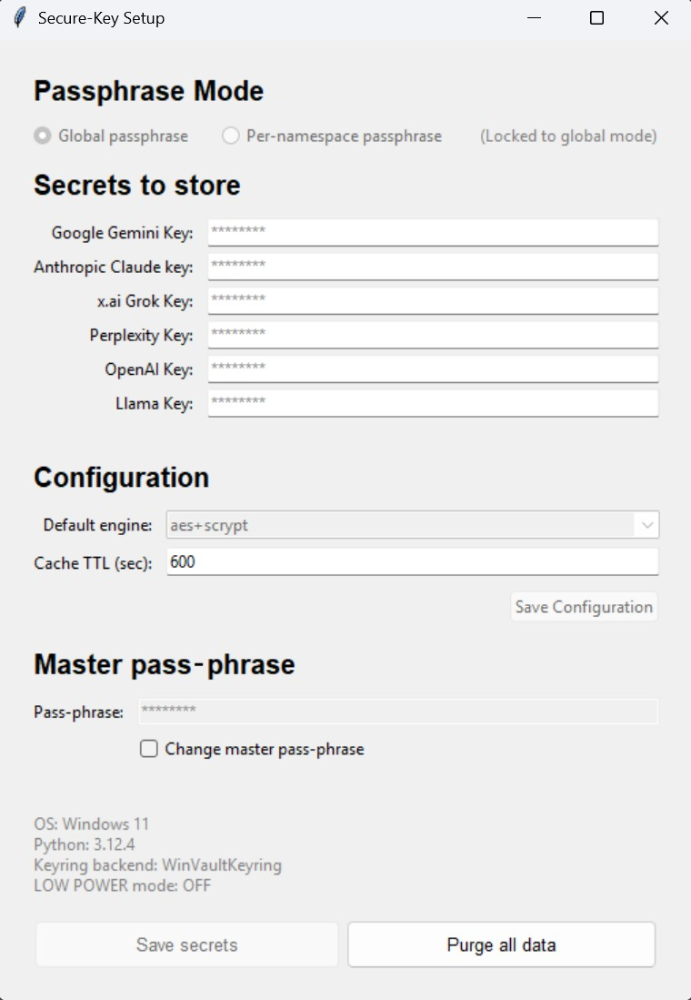

# StructOut Secure Credentials Setup

This guide walks you through **securely** storing and retrieving API keys for OpenAI, Anthropic, xAI (Grok), Perplexity, Google Gemini, and Meta Llama.  
StructOut's credential helper works identically on **Windows, macOS, and Linux**, offering both a **GUI** and a **CLI**.

> ⚠️ **Use at Your Own Risk**  
> All keys grant access to paid services. Monitor usage and set billing alerts for each provider.

---

## 1. Obtain Your API Keys

| Provider | Console URL |
|----------|-------------|
| **OpenAI** | <https://platform.openai.com/settings/organization/api-keys> |
| **Anthropic (Claude)** | <https://console.anthropic.com/settings/keys> |
| **xAI (Grok)** | <https://console.x.ai/team/> |
| **Perplexity** | <https://www.perplexity.ai/account/api/keys> |
| **Google Gemini** | Cloud Console → **APIs & Services → Credentials** |
| **Meta Llama** | <https://llama.developer.meta.com/api-keys> |

Copy each key and **never** commit it to version control.

---

## 2. How It Works — Security & Technology

| Layer | Details |
|-------|---------|
| **Storage** | Native OS keyring (Keychain, Credential Manager, Secret Service/KWallet) |
| **Encryption engines** | `aes+scrypt` (AES-256-GCM + scrypt) • `chacha+argon2` (ChaCha20-Poly1305 + Argon2id) |
| **KDF hardening** | Salts + high work-factor; resists brute-force |
| **Lock-out** | 5 wrong attempts → 5-minute cooldown |
| **Pass-phrase cache** | Key cached (default 10 min) in keyring; optional Linux kernel keyring layer |
| **Secure memory** | Best-effort wiping of plaintext keys & pass-phrases |

---

## 3. Key Features

* **Global vs Per-Namespace Pass-phrases**
  * *Global* (default) — one master pass-phrase unlocks everything.
  * *Per-namespace* — each provider isolated with its own pass-phrase.
* **Configuration Management** — mode, cipher, and cache-TTL are stored securely and lock after first save.
* **Cross-Platform** — identical behaviour on Win/macOS/Linux.
* **Dual Interface** — GUI for ease, CLI for automation.

---

## 4. Quick Start

1. Place `secure_key.py`, `secure_key_gui.py`, and (optionally) `constants.py` in one folder.
2. **Install requirements:**
   ```bash
   pip install -r requirements.txt
   ```
3. **Run the GUI:**
   ```bash
   python secure_key_gui.py
   ```
4. **Paste your API keys** into the fields shown (defaults to Global mode).
5. **Create a strong master pass-phrase** (≥ 14 chars, mixed case, digits, symbols).
6. **Click Save secrets** — your keys are encrypted and stored.
7. **Access a key in code:**
   ```python
   from secure_key import get_api_key
   openai_key = get_api_key("OPENAI_API_KEY")
   ```

---

## 5. GUI Setup Walkthrough

### Launch the GUI

```bash
python secure_key_gui.py
```

### GUI Interface Overview



The GUI provides an intuitive interface with four main sections:
- **Passphrase Mode** - Choose between global or per-namespace security
- **Secrets to store** - Input fields for each API provider
- **Configuration** - Encryption engine and cache settings
- **Master pass-phrase** - Secure passphrase entry

### 5.1 Initial Setup

1. **Choose Pass-phrase Mode**
- **Global** (default) – one master pass-phrase secures all providers.
- **Per-namespace** – each provider gets its own pass-phrase.
- ⚠️ Once you click Save, the mode is locked until you Purge All.

2. **Enter Your Secrets**
- Paste each API key into its field ­– the text is masked as `********`.

3. **Set Your Pass-phrase(s)**
- **Global mode:** enter a single strong pass-phrase (≥ 14 chars, upper/lower, digits, symbols).
- **Per-namespace mode:** a pass-phrase box appears beside every key; fill each one.

4. **Optional Options**
- **Default engine:** choose `aes+scrypt` (default) or `chacha+argon2`.
- **Cache TTL (sec):** how long the pass-phrase stays cached (default 600).

5. **Save**
- Click **Save secrets** – keys are encrypted in the OS keyring; mode & engine are frozen.

### 5.2 Updating and Rotating Keys

| Action | Steps |
|--------|-------|
| **Add / replace a key** | Paste new value → Save secrets → enter pass-phrase to confirm. |
| **Change master pass-phrase** <br/>(Global mode) | Tick **Change master pass-phrase** → enter current + new pass-phrase → Save secrets (all keys re-encrypted). |

### 5.3 Purging Everything

1. Click **Purge all data**.
2. Confirm in the banner.
3. The vault resets – you can choose a new mode next time.

---

## 6. CLI Option

_If you prefer Command Line Interface instead of GUI to setup your API Keys, the following commands are handy_

_CLI gives all the same features available in the GUI Interface (matter of preference)_


### Get help

```bash
python secure_key.py --help
```

### 6.1 Initial Setup

```bash
python secure_key.py --init
```

1. **Mode** → `global` or `local` (per-namespace).
2. **Engine** → `aes+scrypt` or `chacha+argon2`.
3. **Cache TTL in seconds**.
4. **Pass-phrase(s)** → create & confirm.
5. **Paste each API key** when prompted.

All settings and encrypted blobs are now stored in the keyring.

### 6.2 Common Commands

| Purpose | Command |
|---------|---------|
| List stored keys | `python secure_key.py --list` |
| Update a key | `python secure_key.py --update OPENAI_API_KEY` |
| Change master pass-phrase | `python secure_key.py --change-passphrase "<current>" "<new>"` |
| Diagnostics | `python secure_key.py --status` |
| Set cache TTL | `python secure_key.py --set-ttl 1800` |
| Switch cipher | `python secure_key.py --set-engine chacha+argon2` |
| Clear cached pass-phrases | `python secure_key.py --clear-cache` |
| Purge everything | `python secure_key.py --purge-all` |

---

## 7. Using Your Keys in Code

```python
from secure_key import get_api_key

try:
    openai_key     = get_api_key("OPENAI_API_KEY")      # prompts first time
    anthropic_key  = get_api_key("ANTHROPIC_API_KEY")
    grok_key       = get_api_key("GROK_API_KEY")        # cached → no prompt

    # …use the keys here…

except RuntimeError as err:
    print(f"Credential error: {err}")
```

---

## 8. Troubleshooting

| Symptom | Solution |
|---------|----------|
| "Tk 8.6 required" | Install python-tk (`brew`, `apt`, or python.org installer). |
| Keyring backend errors | Ensure system keychain is unlocked / writable. |
| 5-minute lock-out | Wait or run `--clear-cache`. |
| Forgot pass-phrase | `--purge-all` (irreversible) then re-initialise. |

---

## 9. Advanced Environment Variables

| Variable | Purpose | Default |
|----------|---------|---------|
| `SK_DEFAULT_TTL` | Cache lifetime (sec) | `600` |
| `SK_DEFAULT_ENGINE` | Pre-select cipher | `aes+scrypt` |
| `SK_LOW_POWER=1` | Reduce KDF work-factor for slow CPUs | off |
| `SECURE_KEY_LOG=STDOUT` | Verbose debug logging | off |

---

## 10. Next Steps

1. **Fetch all six provider keys**.
2. **Run the GUI or CLI quick-start**.
3. **Call `get_api_key()`** wherever StructOut (or any Python project) needs credentials.

Your secrets are now encrypted, cached, and ready for production 🚀
