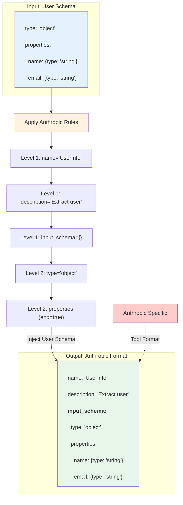

```mermaid
graph TB
    subgraph "Input: User Schema"
        US2["<div style='text-align: left'>
        type: 'object'<br/>
        properties:<br/>
        &nbsp;&nbsp;name: {type: 'string'}<br/>
        &nbsp;&nbsp;email: {type: 'string'}
        </div>"]
    end
    
    US2 --> T2[Apply Anthropic Rules]
    
    T2 --> A1["Level 1: name='UserInfo'"]
    A1 --> A2["Level 1: description='Extract user'"]
    A2 --> A3["Level 1: input_schema={}"]
    A3 --> A4["Level 2: type='object'"]
    A4 --> A5["Level 2: properties (end=true)"]
    
    A5 --> |"Inject User Schema"| Result2
    
    subgraph "Output: Anthropic Format"
        Result2["<div style='text-align: left'>
        name: 'UserInfo'<br/>
        description: 'Extract user'<br/>
        <b>input_schema:</b><br/>
        &nbsp;&nbsp;type: 'object'<br/>
        &nbsp;&nbsp;properties:<br/>
        &nbsp;&nbsp;&nbsp;&nbsp;name: {type: 'string'}<br/>
        &nbsp;&nbsp;&nbsp;&nbsp;email: {type: 'string'}
        </div>"]
    end
    
    Anthropic1[Anthropic Specific] -.-> |"Tool Format"| Result2
    
    style US2 fill:#e3f2fd
    style Result2 fill:#e8f5e9
    style T2 fill:#fff3e0
    style Anthropic1 fill:#ffcccc
```
