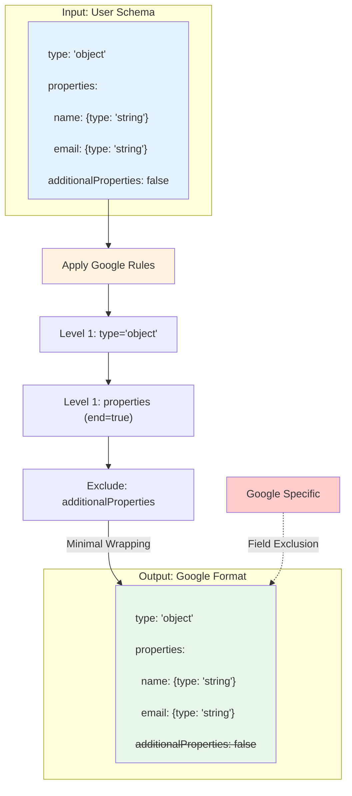

```mermaid
graph TB
    subgraph "Input: User Schema"
        US3["<div style='text-align: left'>
        type: 'object'<br/>
        properties:<br/>
        &nbsp;&nbsp;name: {type: 'string'}<br/>
        &nbsp;&nbsp;email: {type: 'string'}<br/>
        additionalProperties: false
        </div>"]
    end
    
    US3 --> T3[Apply Google Rules]
    
    T3 --> G1["Level 1: type='object'"]
    G1 --> G2["Level 1: properties (end=true)"]
    G2 --> G3["Exclude: additionalProperties"]
    
    G3 --> |"Minimal Wrapping"| Result3
    
    subgraph "Output: Google Format"
        Result3["<div style='text-align: left'>
        type: 'object'<br/>
        properties:<br/>
        &nbsp;&nbsp;name: {type: 'string'}<br/>
        &nbsp;&nbsp;email: {type: 'string'}<br/>
        <s>additionalProperties: false</s>
        </div>"]
    end
    
    Google1[Google Specific] -.-> |"Field Exclusion"| Result3
    
    style US3 fill:#e3f2fd
    style Result3 fill:#e8f5e9
    style T3 fill:#fff3e0
    style Google1 fill:#ffcccc
```
