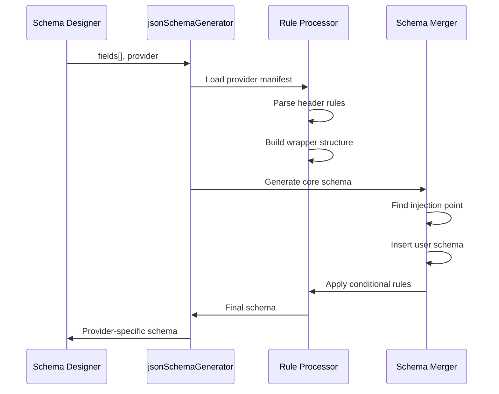

## Flow

## Key Takeaways

1. **Provider Independence**: One schema definition works for all providers
2. **Rule-Based Transformation**: Header rules define exact output structure
3. **Level-Based Processing**: Rules are applied in order by nesting level
4. **Flexible Injection**: User schema inserted at `end: true` marker
5. **Post-Processing**: Conditional rules and exclusions applied after merge
6. **Type Safety**: Full TypeScript types ensure correct transformations

This algorithm ensures that switching providers in the UI instantly generates the correct schema format without any manual intervention.
