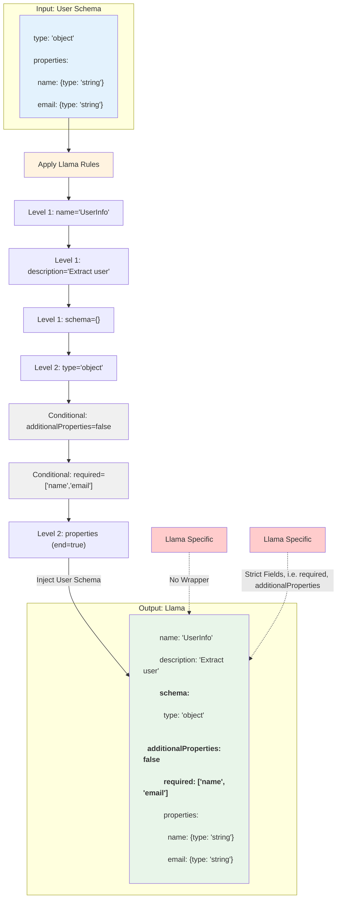

```mermaid
graph TB
    subgraph "Input: User Schema"
        US4["<div style='text-align: left'>
        type: 'object'<br/>
        properties:<br/>
        &nbsp;&nbsp;name: {type: 'string'}<br/>
        &nbsp;&nbsp;email: {type: 'string'}
        </div>"]
    end
    
    US4 --> T4[Apply Llama Rules]
    
    T4 --> L1["Level 1: name='UserInfo'"]
    L1 --> L2["Level 1: description='Extract user'"]
    L2 --> L3["Level 1: schema={}"]
    L3 --> L4["Level 2: type='object'"]
    L4 --> L5["Conditional: additionalProperties=false"]
    L5 --> L6["Conditional: required=['name','email']"]
    L6 --> L7["Level 2: properties (end=true)"]
    
    L7 --> |"Inject User Schema"| Result4
    
    subgraph OutputBox["Output: Llama"]
        Result4["<div style='text-align: left'>
        name: 'UserInfo'<br/>
        description: 'Extract user'<br/>
        <b>schema:</b><br/>
        &nbsp;&nbsp;type: 'object'<br/>
        &nbsp;&nbsp;<b>additionalProperties: false</b><br/>
        &nbsp;&nbsp;<b>required: ['name', 'email']</b><br/>
        &nbsp;&nbsp;properties:<br/>
        &nbsp;&nbsp;&nbsp;&nbsp;name: {type: 'string'}<br/>
        &nbsp;&nbsp;&nbsp;&nbsp;email: {type: 'string'}
        </div>"]
    end
    
    Llama1[Llama Specific] -.-> |"No Wrapper"| Result4
    Llama2[Llama Specific] -.-> |"Strict Fields, i.e. required, additionalProperties"| Result4
    
    style US4 fill:#e3f2fd
    style Result4 fill:#e8f5e9
    style T4 fill:#fff3e0
    style Llama1 fill:#ffcccc
    style Llama2 fill:#ffcccc
    style L5 fill:#f0f0f0
    style L6 fill:#f0f0f0
```
