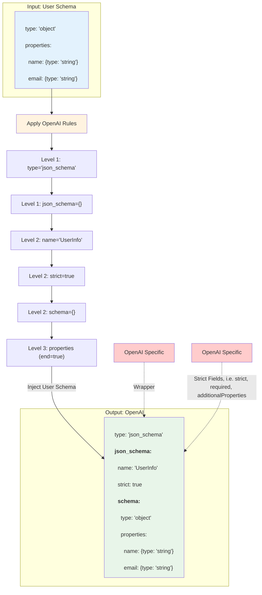

```mermaid
graph TB
    subgraph "Input: User Schema"
        US["<div style='text-align: left'>
        type: 'object'<br/>
        properties:<br/>
        &nbsp;&nbsp;name: {type: 'string'}<br/>
        &nbsp;&nbsp;email: {type: 'string'}
        </div>"]
    end
    
    US --> T1[Apply OpenAI Rules]
    
    T1 --> R1["Level 1: type='json_schema'"]
    R1 --> R2["Level 1: json_schema={}"]
    R2 --> R3["Level 2: name='UserInfo'"]
    R3 --> R4["Level 2: strict=true"]
    R4 --> R5["Level 2: schema={}"]
    R5 --> R6["Level 3: properties (end=true)"]
    
    R6 --> |"Inject User Schema"| Result1
    
    subgraph "Output: OpenAI"
        Result1["<div style='text-align: left'>
        type: 'json_schema'<br/>
        <b>json_schema:</b><br/>
        &nbsp;&nbsp;name: 'UserInfo'<br/>
        &nbsp;&nbsp;strict: true<br/>
        &nbsp;&nbsp;<b>schema:</b><br/>
        &nbsp;&nbsp;&nbsp;&nbsp;type: 'object'<br/>
        &nbsp;&nbsp;&nbsp;&nbsp;properties:<br/>
        &nbsp;&nbsp;&nbsp;&nbsp;&nbsp;&nbsp;name: {type: 'string'}<br/>
        &nbsp;&nbsp;&nbsp;&nbsp;&nbsp;&nbsp;email: {type: 'string'}
        </div>"]
    end
    
    OpenAI1[OpenAI Specific] -.-> |"Wrapper"| Result1
    OpenAI2[OpenAI Specific] -.-> |"Strict Fields, i.e. strict, required, additionalProperties"| Result1
    
    style US fill:#e3f2fd
    style Result1 fill:#e8f5e9
    style T1 fill:#fff3e0
    style OpenAI1 fill:#ffcccc
    style OpenAI2 fill:#ffcccc
```
