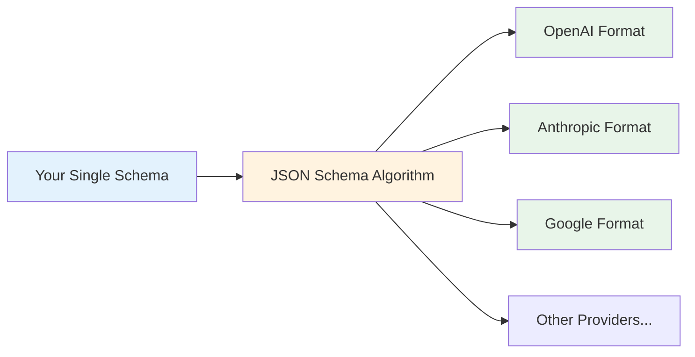
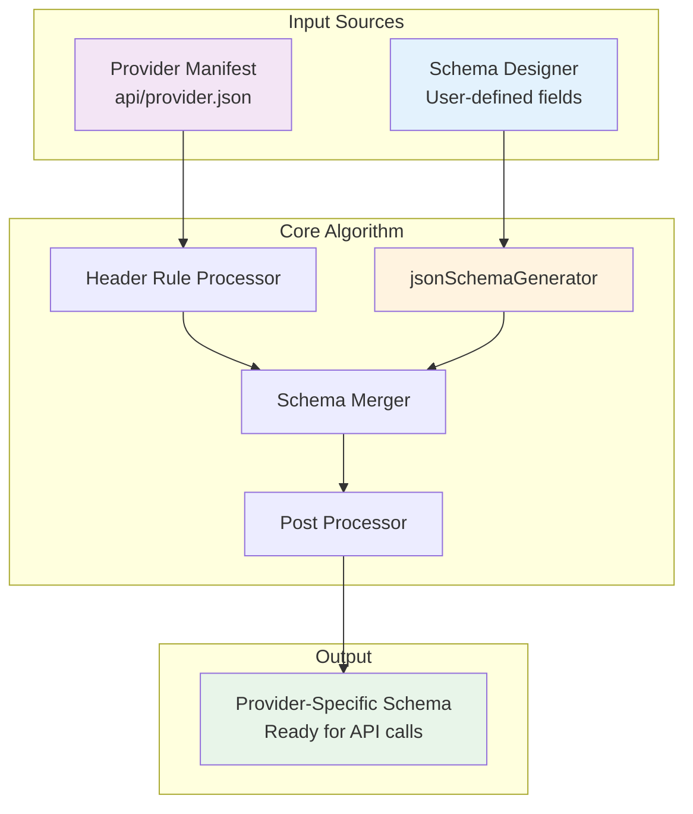
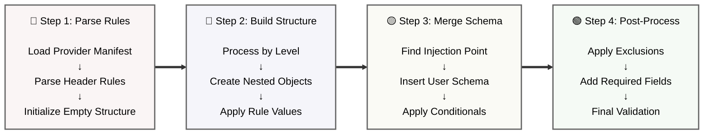
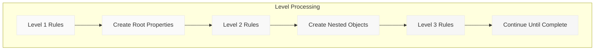
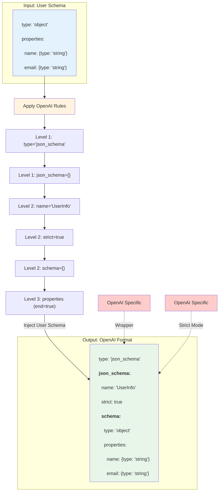
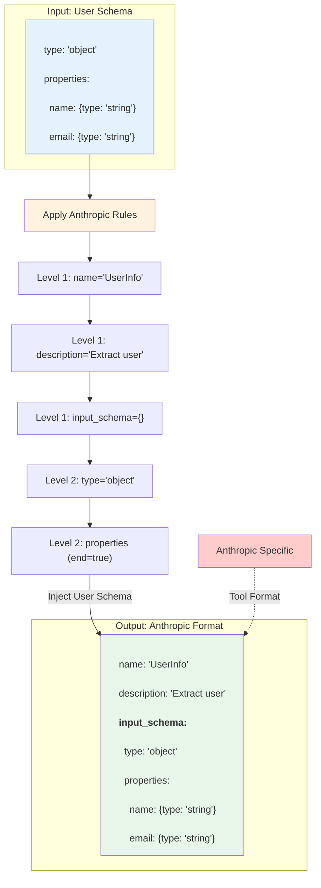
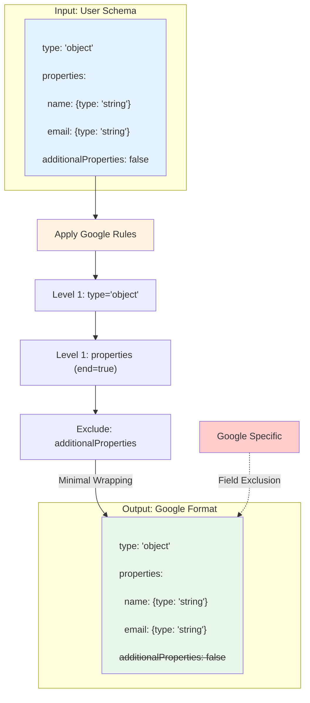
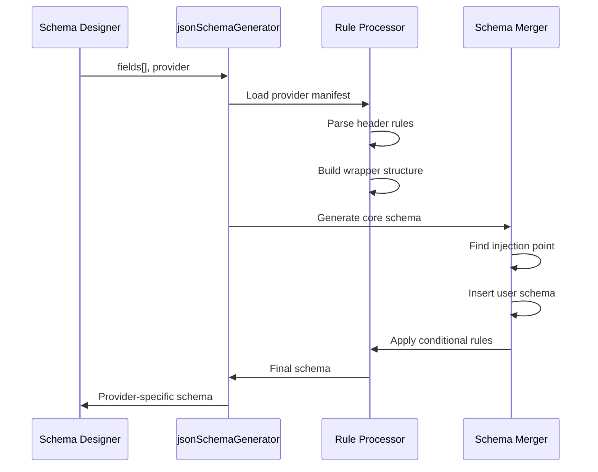

# JSON Schema Algorithm

## The Problem

Imagine you've designed a simple schema to extract user information:

```json
{
  "type": "object",
  "properties": {
    "name": {
      "type": "string",
      "description": "User's full name"
    },
    "email": {
      "type": "string",
      "description": "User's email address"
    },
    "age": {
      "type": "integer",
      "description": "User's age in years"
    }
  },
  "required": ["name", "email"]
}
```

### Without StructOut: Manual Conversion Nightmare

You'd need to manually create different versions for each provider:

**OpenAI expects:**
```json
{
  "type": "json_schema",
  "json_schema": {
    "name": "UserInfo",
    "description": "Extract user information",
    "strict": true,
    "schema": {
      "type": "object",
      "additionalProperties": false,
      "properties": {
        "name": {
          "type": "string",
          "description": "User's full name"
        },
        "email": {
          "type": "string",
          "description": "User's email address"
        },
        "age": {
          "type": "integer",
          "description": "User's age in years"
        }
      },
      "required": ["name", "email"]
    }
  }
}
```

**Anthropic expects:**
```json
{
  "name": "UserInfo",
  "description": "Extract user information",
  "input_schema": {
    "type": "object",
    "properties": {
      "name": {
        "type": "string",
        "description": "User's full name"
      },
      "email": {
        "type": "string",
        "description": "User's email address"
      },
      "age": {
        "type": "integer",
        "description": "User's age in years"
      }
    },
    "required": ["name", "email"]
  }
}
```

**Google Gemini expects:**
```json
{
  "type": "object",
  "properties": {
    "name": {
      "type": "string",
      "description": "User's full name"
    },
    "email": {
      "type": "string",
      "description": "User's email address"
    },
    "age": {
      "type": "integer",
      "description": "User's age in years"
    }
  },
  "required": ["name", "email"]
}
```

### The Challenge

- **6 different formats** to maintain (OpenAI, Anthropic, Google, Grok, Perplexity, Llama)
- **Manual updates** when providers change their requirements
- **Error-prone** copy-paste between formats
- **Version control nightmare** tracking changes across formats
- **No single source of truth** for your schema definition

### The Solution

StructOut's JSON Schema Algorithm automatically transforms your single schema definition into the correct format for each provider when you switch the dropdown in the Generated Schema Panel.



### When Providers Change Requirements

**Scenario**: OpenAI adds a new required field `version: "1.0"`

Without StructOut:
- Update all OpenAI schemas manually
- Risk missing some schemas
- Test each one individually
- Hope you didn't break anything

With StructOut:
- Update one rule in `openai.json`
- All schemas automatically get the new field
- Single point of maintenance

---

## Overview

StructOut uses a sophisticated algorithm to transform user-defined schemas into provider-specific formats. When you switch providers in the Generated Schema Panel, the system automatically applies different transformation rules to create the exact format each LLM provider expects.

## Architecture Overview



## Core Components

### 1. Provider Manifest Structure

Each provider has a JSON manifest in `/src/api/` containing:

```
{
  "provider": "openai",
  "apiKey": "OPENAI_API_KEY",
  "llmSchemaHeader": "[...]",      // Transformation rules
  "schemaExclude": ["..."],         // Optional: fields to remove
  "genAIURLPathParameter": "..."    // Optional: API endpoint
}
```

### 2. Header Rules

Header rules define how to construct the wrapper around your schema:

```
interface HeaderRuleEntry {
  key: string;                      // JSON property name
  type: "object" | "string" | "keyvalue" | "boolean" | "array";
  value?: any;                      // Static value
  level: number;                    // Nesting depth
  sourceparam?: "schemaName" | "schemaDescription";  // Dynamic values
  action?: "include" | "exclude";   // Conditional application
  actionLevel?: ("object" | "array")[];  // Where to apply
  end?: boolean;                    // Schema injection point
}
```

## The Transformation Algorithm



### Step 1: Initialize and Parse

The algorithm starts by:

1. Loading the provider's JSON manifest.

2. Parsing the `llmSchemaHeader` rules.

3. Creating an empty root object

```
const ruleArray = JSON.parse(manifest.llmSchemaHeader);
const root = {};
const stack = [{ node: root, level: 0, nodeType: "object" }];
```

### Step 2: Build Wrapper Structure

Rules are processed level by level, building the nested structure:



### Step 3: Schema Injection

When a rule has `end: true`, the user's schema is injected:

```
if (rule.end) {
  // This is where user schema properties are inserted
  mergeUserSchemaHere(currentNode, userSchema);
}
```

### Step 4: Post-Processing

After the structure is built:

1. **Apply conditional rules**: Add fields based on `action` and `actionLevel`

2. **Remove excluded fields**: Strip fields listed in `schemaExclude`

3. **Add computed values**: Like `required` arrays from field definitions

## Provider Examples

### OpenAI Transformation



### Anthropic Transformation



### Google Gemini Transformation



## Rule Processing Details

### Level-Based Construction

The algorithm maintains a stack to track nesting:

```
// Process rules by level
for (const rule of rules) {
  // Pop stack until we're at the right level
  while (stack.length && stack[stack.length - 1].level >= rule.level) {
    stack.pop();
  }
  
  // Apply rule at current level
  const parent = stack[stack.length - 1].node;
  processRule(parent, rule);
}
```

### Rule Type Handlers

Each rule type has specific behavior:

| Rule Type | Action | Example |
|-----------|--------|---------|
| `object` | Creates empty object | `schema: {}` |
| `keyvalue` | Sets literal value | `strict: true` |
| `string` | Sets string value | `name: "MySchema"` |
| `boolean` | Sets boolean value | `additionalProperties: false` |
| `array` | Creates array | `required: ["name", "age"]` |

### Dynamic Value Resolution

Some rules pull values dynamically:

```
if (rule.sourceparam === "schemaName") {
  parent[rule.key] = schemaName;
} else if (rule.sourceparam === "schemaDescription") {
  parent[rule.key] = schemaDescription;
} else if (rule.value === "{keynames}") {
  parent[rule.key] = Object.keys(properties);
}
```

## Advanced Features

### Conditional Rules

Rules can be applied conditionally based on the parent type:

```
{
  "key": "additionalProperties",
  "type": "boolean",
  "value": false,
  "action": "include",
  "actionLevel": ["object"]  // Only applied to object types
}
```

### Schema Exclusions

Providers can exclude unsupported keywords:

```
{
  "provider": "google-gemini",
  "schemaExclude": ["additionalProperties", "patternProperties"]
}
```

These fields are removed recursively from the entire schema tree.

### Computed Fields

The `{keynames}` placeholder automatically generates required arrays:

```
{
  "key": "required",
  "type": "array",
  "action": "include",
  "actionLevel": ["object"],
  "value": "{keynames}"  // Becomes ["field1", "field2", ...]
}
```

## Implementation Flow



## Key Takeaways

1. **Provider Independence**: One schema definition works for all providers
2. **Rule-Based Transformation**: Header rules define exact output structure
3. **Level-Based Processing**: Rules are applied in order by nesting level
4. **Flexible Injection**: User schema inserted at `end: true` marker
5. **Post-Processing**: Conditional rules and exclusions applied after merge
6. **Type Safety**: Full TypeScript types ensure correct transformations

This algorithm ensures that switching providers in the UI instantly generates the correct schema format without any manual intervention.
