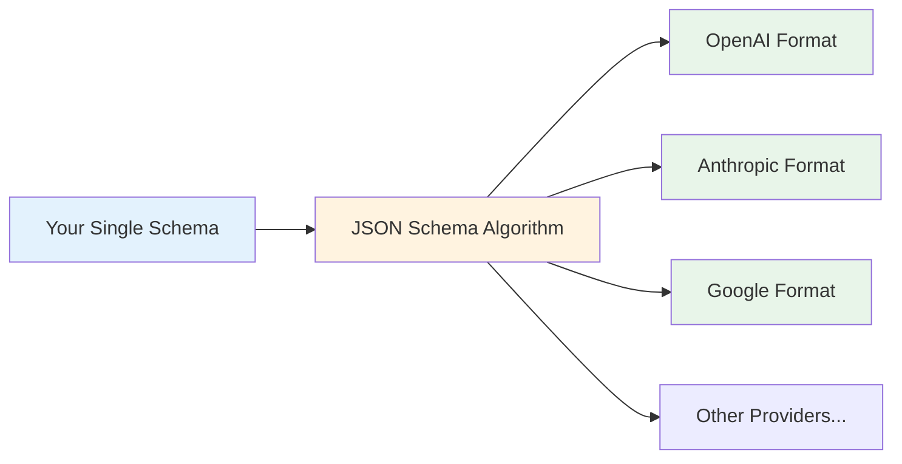
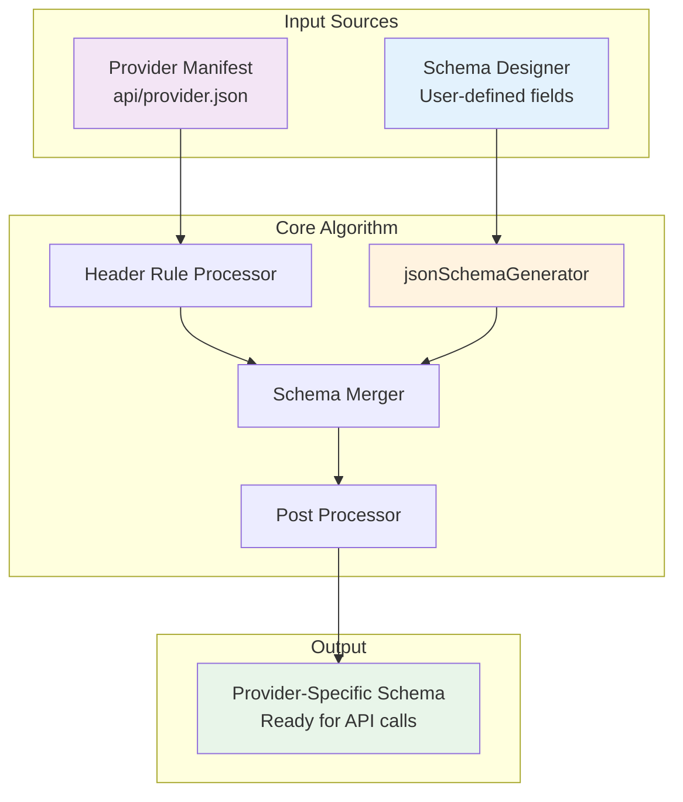
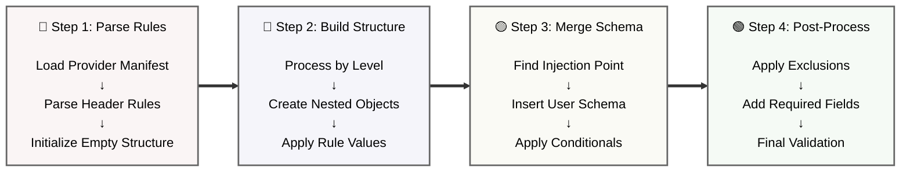
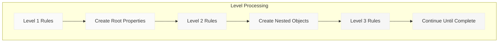

StructOut's JSON Schema Algorithm automatically transforms your single schema definition into the correct format for each provider when you switch the dropdown in the Generated Schema Panel.



### When Providers Change Requirements

**Scenario**: OpenAI adds a new required field `version: "1.0"`

Without StructOut:
- Update all OpenAI schemas manually
- Risk missing some schemas
- Test each one individually
- Hope you didn't break anything

With StructOut:
- Update one rule in `openai.json`
- All schemas automatically get the new field
- Single point of maintenance

---

## Overview

StructOut uses a sophisticated algorithm to transform user-defined schemas into provider-specific formats. When you switch providers in the Generated Schema Panel, the system automatically applies different transformation rules to create the exact format each LLM provider expects.

## Architecture Overview



## Core Components

### 1. Provider Manifest Structure

Each provider has a JSON manifest in `/src/api/` containing:

```json
{
  "provider": "openai",
  "apiKey": "OPENAI_API_KEY",
  "llmSchemaHeader": "[...]",      // Transformation rules
  "schemaExclude": ["..."],         // Optional: fields to remove
  "genAIURLPathParameter": "..."    // Optional: API endpoint
}
```

### 2. Header Rules

Header rules define how to construct the wrapper around your schema:

```typescript
interface HeaderRuleEntry {
  key: string;                      // JSON property name
  type: "object" | "string" | "keyvalue" | "boolean" | "array";
  value?: any;                      // Static value
  level: number;                    // Nesting depth
  sourceparam?: "schemaName" | "schemaDescription";  // Dynamic values
  action?: "include" | "exclude";   // Conditional application
  actionLevel?: ("object" | "array")[];  // Where to apply
  end?: boolean;                    // Schema injection point
}
```

## The Transformation Algorithm



### Step 1: Initialize and Parse

The algorithm starts by:

1. Loading the provider's JSON manifest.

2. Parsing the `llmSchemaHeader` rules.

3. Creating an empty root object

```typescript
const ruleArray = JSON.parse(manifest.llmSchemaHeader);
const root = {};
const stack = [{ node: root, level: 0, nodeType: "object" }];
```

### Step 2: Build Wrapper Structure

Rules are processed level by level, building the nested structure:



### Step 3: Schema Injection

When a rule has `end: true`, the user's schema is injected:

```typescript
if (rule.end) {
  // This is where user schema properties are inserted
  mergeUserSchemaHere(currentNode, userSchema);
}
```

### Step 4: Post-Processing

After the structure is built:

1. **Apply conditional rules**: Add fields based on `action` and `actionLevel`

2. **Remove excluded fields**: Strip fields listed in `schemaExclude`

3. **Add computed values**: Like `required` arrays from field definitions
