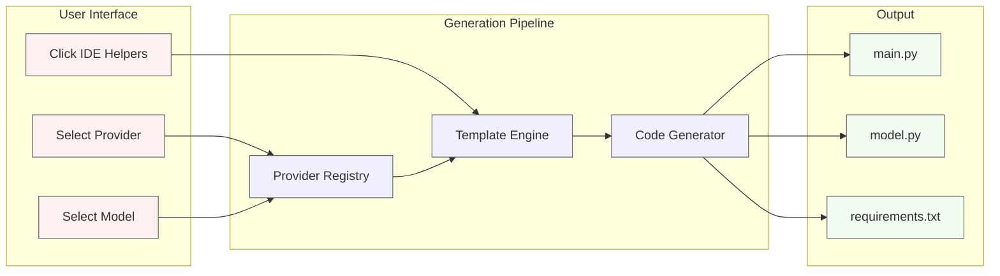

### High-Level Flow



### Key Files

```
src/utils/

├── providerRegistry.ts      # Provider configurations & API snippets

├── providerSnippets.ts      # Template engine for Python generation

├── ideHelperGenerator.ts    # Pydantic model generation

├── bundleHelpers.ts         # ZIP bundle creation

└── loadProviderConfig.ts    # Provider manifest loader
```

```
src/api/

├── openai.json             # OpenAI header rules

├── anthropic.json          # Anthropic header rules

├── google-gemini.json      # Gemini header rules

└── ... other providers
```
