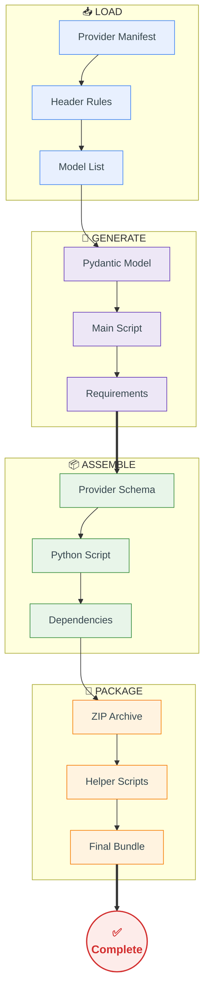

### 1. Provider Selection Process (Sample)

| User Action | System Response |
|-------------|-----------------|
| Select "anthropic" | Load anthropic config from registry |
| Select "haiku" model | Get model ID "claude-3-5-haiku-20241022" |
| Click "main" tab | Generate Python script with Anthropic SDK |

### 2. Code Generation Pipeline

