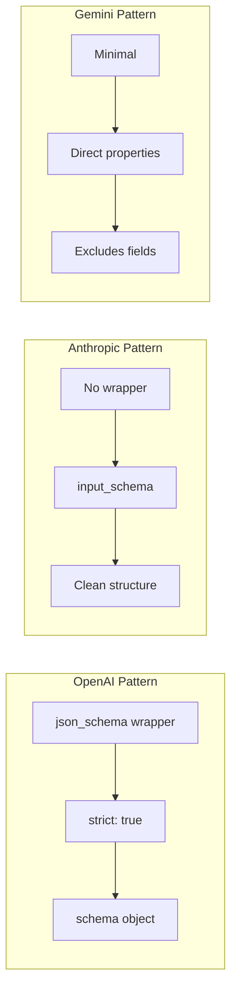

## Provider Configurations

### Current Provider Support

| Provider | SDK Type | Models | Special Features |
|----------|----------|---------|------------------|
| **OpenAI** | Native | gpt-4o, gpt-3.5-turbo | Beta parsing API |
| **Anthropic** | Native | Claude Sonnet/Haiku | Tool-based approach |
| **Google Gemini** | Native | Flash, Pro | Config-based |
| **Grok** | OpenAI-compatible | grok-3, grok-3-fast | Custom base URL |
| **Perplexity** | OpenAI-compatible | sonar-pro, sonar | Custom base URL |
| **Llama** | Native | Maverick-17B | Hybrid approach |

### Provider Schema Patterns

